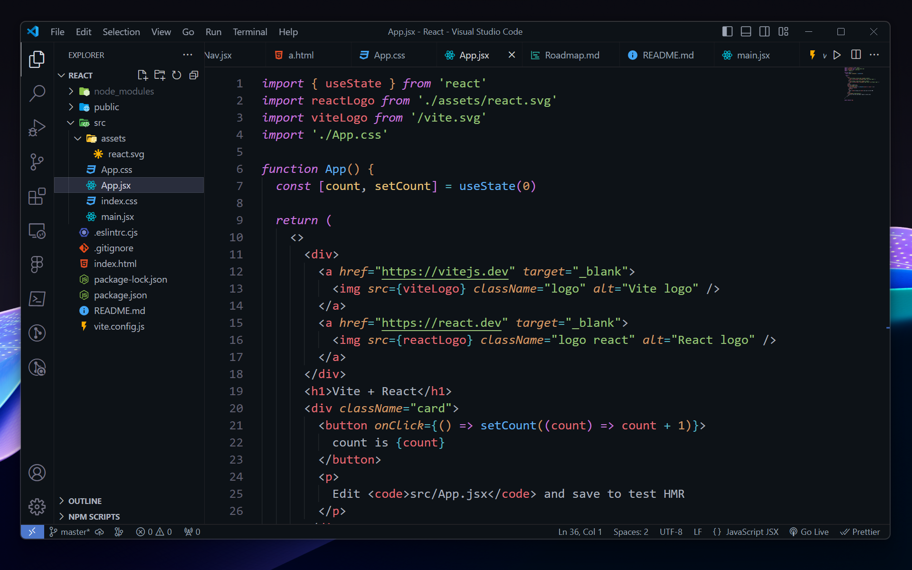

# Unleash Focus with Atomify: A Minimalist Dark Theme for VS Code

Atomify is a meticulously crafted dark theme for VS Code, designed to enhance your focus and elevate your coding experience.

### Inspired by Atom

I've taken the beloved syntax highlighting of Atom and integrated it seamlessly into VS Code. This ensures familiarity and a smooth transition for Atom users.

### Minimalist Elegance

Atomify embraces a dark, minimalist aesthetic. With a carefully chosen color palette, that minimize distractions and prioritize code readability.

## Features

- **Atom-inspired Syntax Highlighting:** Enjoy the familiar and powerful syntax highlighting from Atom, ensuring clear distinction between code elements.
- **Dark and Minimalist Design:** Focus on your code with a dark background and a sleek, uncluttered interface.
- **Enhanced Readability:** The color scheme is meticulously balanced to provide excellent readability even for extended coding sessions.
- **Reduced Eye Strain:** The dark theme is gentle on your eyes, promoting comfort during long coding hours.
- **Lightweight and Efficient:** Enjoy a smooth, responsive coding experience without sacrificing performance.

## Getting Started

1. Open the VS Code Extensions tab (Ctrl+Shift+X on Windows/Linux, Cmd+Shift+X on macOS).
2. Search for "Atomify".
3. Click "Install" and wait for the installation to complete.
4. Open the Command Palette (Ctrl+Shift+P on Windows/Linux, Cmd+Shift+P on macOS).
5. Type "Preferences: Color Theme" and select "Atomify".

## We Value Your Feedback

I value your feedback! If you've encountered any issues with Atomify, or have thoughts on how i can do better, please offer your feedback in a review.

Happy Coding!

Swayam Rabari

[def]: themedemo.png
